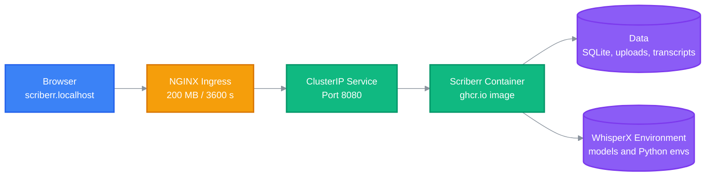

<!-- BEAUTIFIED -->

<div align="right">

English

</div>

<h1 align="center">Scriberr</h1>
<p align="center">
  <strong>Runs Scriberr as a persistent Kubernetes workload for local audio transcription.</strong>
  <br />
  <em>Kubernetes deployment · Persistent transcription data · WhisperX model environment</em>
</p>

<p align="center">
  <a href="#quick-start"></a>
  <a href="LICENSE"></a>
</p>

<p align="center">
  
  
</p>

## Features

| Feature | Description |
|---|---|
| Persistent runtime data | Mounts the host `data/` directory into `/app/data` for the database, uploads, and transcripts. |
| Persistent model environment | Mounts `whisperx-env/` into the container so model assets and Python environments survive restarts. |
| Long transcription support | Configures NGINX ingress timeouts up to 3,600 seconds and accepts request bodies up to 200 MB. |
| Resource controls | Requests 500 millicores and 2 GiB of memory while limiting memory usage to 8 GiB. |
| Local ingress | Exposes the service as `scriberr.localhost` through the NGINX ingress class. |

## Quick Start

### Prerequisites

- A Kubernetes cluster with the NGINX Ingress Controller
- `kubectl` configured for the target cluster
- Host directories under `/mnt/workspaces/scriberr`

### Configure Secrets

Use local values and keep the generated secret manifest outside version control:

```bash
kubectl create secret generic scriberr-secret \
  --from-literal=HF_TOKEN='<hugging-face-token>' \
  --from-literal=JWT_SECRET='<random-secret>'
```

### Deploy

```bash
kubectl apply -f k8s/scriberr-deployment.yaml
```

### Verify

```bash
kubectl rollout status deployment/scriberr
kubectl logs deployment/scriberr --follow
```

## Usage

### Open Scriberr

After the Ingress reports an address, open:

```text
http://scriberr.localhost
```

### Validate Before Applying

```bash
kubectl apply --dry-run=client -f k8s/scriberr-deployment.yaml
```

## Architecture

Traffic enters through NGINX and reaches the Scriberr container, which stores mutable data and model assets on the host.



## Configuration

### Deployment Environment

| Variable | Purpose | Value |
|---|---|---|
| `TZ` | Container timezone | `Asia/Hong_Kong` |
| `APP_ENV` | Application runtime mode | `production` |
| `PUID` | Runtime user ID | `1000` |
| `PGID` | Runtime group ID | `1000` |
| `HF_TOKEN` | Hugging Face access token supplied by `scriberr-secret` | Secret |
| `JWT_SECRET` | JWT signing secret supplied by `scriberr-secret` | Secret |

### Kubernetes Resources

| Setting | Value |
|---|---|
| Container image | `ghcr.io/rishikanthc/scriberr:latest` |
| Service port | `8080` |
| CPU request | `500m` |
| Memory request | `2Gi` |
| Memory limit | `8Gi` |

## Project Structure

```text
.
├── AGENTS.md                       # Contributor and agent guidance
├── README.md                       # Deployment documentation
├── k8s/                            # Maintained Kubernetes manifests
│   └── scriberr-deployment.yaml    # Ingress, Service, and Deployment
├── data/                           # Ignored database and transcription state
└── whisperx-env/                   # Ignored models and Python environments
```

## Tech Stack

| Layer | Technology | Purpose |
|---|---|---|
| Orchestration | Kubernetes | Runs and connects the Scriberr workload. |
| Routing | NGINX Ingress | Routes local HTTP traffic and supports long uploads. |
| Application | Scriberr container image | Provides the transcription application on port 8080. |
| Storage | SQLite and hostPath volumes | Persists application state, media, transcripts, and model files. |
| Transcription | WhisperX environment | Supplies Python dependencies and speech model assets. |

## Deployment

The manifest creates the Ingress, ClusterIP Service, and single-replica Deployment in the active namespace.

```bash
kubectl apply -f k8s/scriberr-deployment.yaml
kubectl rollout status deployment/scriberr
```

The host paths in the manifest are node-specific. Update both `/mnt/workspaces/scriberr/data` and `/mnt/workspaces/scriberr/whisperx-env` before deploying to a node with a different filesystem layout.

## Contributing

1. Fork the repository and create a focused branch.
2. Update maintained files under `k8s/`; keep runtime data and secrets ignored.
3. Validate manifests with `kubectl apply --dry-run=client -f k8s/scriberr-deployment.yaml`.
4. Commit with a concise subject such as `fix: increase ingress timeout`.
5. Open a pull request describing operational impact and validation results.

## License

[MIT](LICENSE) © 2026 Kevin Tsang (kairosys)
